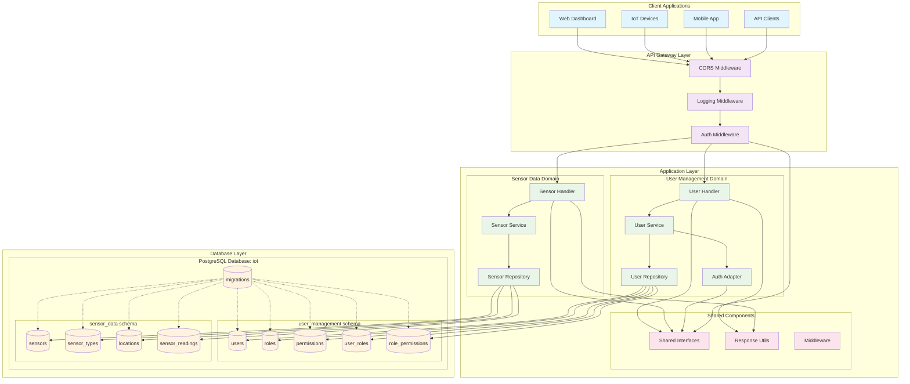

```mermaid
graph TB
    subgraph "Client Applications"
        WEB[Web Dashboard]
        IOT[IoT Devices]
        MOBILE[Mobile App]
        API_CLIENT[API Clients]
    end

    subgraph "API Gateway Layer"
        CORS[CORS Middleware]
        LOG[Logging Middleware]
        AUTH[Auth Middleware]
    end

    subgraph "Application Layer"
        subgraph "User Management Domain"
            USER_H[User Handler]
            USER_S[User Service]
            USER_R[User Repository]
            AUTH_A[Auth Adapter]
        end
        
        subgraph "Sensor Data Domain"
            SENSOR_H[Sensor Handler]
            SENSOR_S[Sensor Service]
            SENSOR_R[Sensor Repository]
        end
        
        subgraph "Shared Components"
            INTERFACES[Shared Interfaces]
            RESPONSE[Response Utils]
            MIDDLEWARE[Middleware]
        end
    end

    subgraph "Database Layer"
        subgraph "PostgreSQL Database: iot"
            subgraph "user_management schema"
                USERS[(users)]
                ROLES[(roles)]
                PERMISSIONS[(permissions)]
                USER_ROLES[(user_roles)]
                ROLE_PERMISSIONS[(role_permissions)]
            end
            
            subgraph "sensor_data schema"
                SENSORS[(sensors)]
                SENSOR_TYPES[(sensor_types)]
                LOCATIONS[(locations)]
                READINGS[(sensor_readings)]
            end
            
            MIGRATIONS[(migrations)]
        end
    end

    %% Client connections
    WEB --> CORS
    IOT --> CORS
    MOBILE --> CORS
    API_CLIENT --> CORS

    %% Middleware chain
    CORS --> LOG
    LOG --> AUTH
    AUTH --> USER_H
    AUTH --> SENSOR_H

    %% User domain flow
    USER_H --> USER_S
    USER_S --> USER_R
    USER_S --> AUTH_A
    USER_R --> USERS
    USER_R --> ROLES
    USER_R --> PERMISSIONS
    USER_R --> USER_ROLES
    USER_R --> ROLE_PERMISSIONS

    %% Sensor domain flow
    SENSOR_H --> SENSOR_S
    SENSOR_S --> SENSOR_R
    SENSOR_R --> SENSORS
    SENSOR_R --> SENSOR_TYPES
    SENSOR_R --> LOCATIONS
    SENSOR_R --> READINGS

    %% Shared dependencies
    USER_H --> INTERFACES
    SENSOR_H --> INTERFACES
    USER_H --> RESPONSE
    SENSOR_H --> RESPONSE
    AUTH_A --> INTERFACES
    AUTH --> INTERFACES

    %% Migration system
    MIGRATIONS -.-> USERS
    MIGRATIONS -.-> ROLES
    MIGRATIONS -.-> PERMISSIONS
    MIGRATIONS -.-> USER_ROLES
    MIGRATIONS -.-> ROLE_PERMISSIONS
    MIGRATIONS -.-> SENSORS
    MIGRATIONS -.-> SENSOR_TYPES
    MIGRATIONS -.-> LOCATIONS
    MIGRATIONS -.-> READINGS

    %% Styling
    classDef clientClass fill:#e1f5fe
    classDef middlewareClass fill:#f3e5f5
    classDef domainClass fill:#e8f5e8
    classDef dbClass fill:#fff3e0
    classDef sharedClass fill:#fce4ec

    class WEB,IOT,MOBILE,API_CLIENT clientClass
    class CORS,LOG,AUTH middlewareClass
    class USER_H,USER_S,USER_R,SENSOR_H,SENSOR_S,SENSOR_R,AUTH_A domainClass
    class USERS,ROLES,PERMISSIONS,USER_ROLES,ROLE_PERMISSIONS,SENSORS,SENSOR_TYPES,LOCATIONS,READINGS,MIGRATIONS dbClass
    class INTERFACES,RESPONSE,MIDDLEWARE sharedClass

```