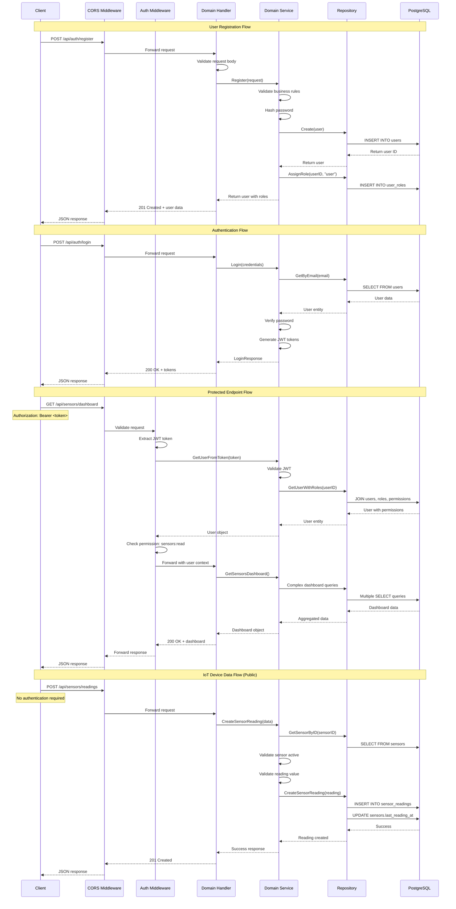

```mermaid
sequenceDiagram
    participant Client
    participant CORS as CORS Middleware
    participant Auth as Auth Middleware
    participant Handler as Domain Handler
    participant Service as Domain Service
    participant Repo as Repository
    participant DB as PostgreSQL

    Note over Client,DB: User Registration Flow
    Client->>CORS: POST /api/auth/register
    CORS->>Handler: Forward request
    Handler->>Handler: Validate request body
    Handler->>Service: Register(request)
    Service->>Service: Validate business rules
    Service->>Service: Hash password
    Service->>Repo: Create(user)
    Repo->>DB: INSERT INTO users
    DB-->>Repo: Return user ID
    Repo-->>Service: Return user
    Service->>Repo: AssignRole(userID, "user")
    Repo->>DB: INSERT INTO user_roles
    Service-->>Handler: Return user with roles
    Handler-->>CORS: 201 Created + user data
    CORS-->>Client: JSON response

    Note over Client,DB: Authentication Flow
    Client->>CORS: POST /api/auth/login
    CORS->>Handler: Forward request
    Handler->>Service: Login(credentials)
    Service->>Repo: GetByEmail(email)
    Repo->>DB: SELECT FROM users
    DB-->>Repo: User data
    Repo-->>Service: User entity
    Service->>Service: Verify password
    Service->>Service: Generate JWT tokens
    Service-->>Handler: LoginResponse
    Handler-->>CORS: 200 OK + tokens
    CORS-->>Client: JSON response

    Note over Client,DB: Protected Endpoint Flow
    Client->>CORS: GET /api/sensors/dashboard
    Note over Client: Authorization: Bearer <token>
    CORS->>Auth: Validate request
    Auth->>Auth: Extract JWT token
    Auth->>Service: GetUserFromToken(token)
    Service->>Service: Validate JWT
    Service->>Repo: GetUserWithRoles(userID)
    Repo->>DB: JOIN users, roles, permissions
    DB-->>Repo: User with permissions
    Repo-->>Service: User entity
    Service-->>Auth: User object
    Auth->>Auth: Check permission: sensors:read
    Auth->>Handler: Forward with user context
    Handler->>Service: GetSensorsDashboard()
    Service->>Repo: Complex dashboard queries
    Repo->>DB: Multiple SELECT queries
    DB-->>Repo: Dashboard data
    Repo-->>Service: Aggregated data
    Service-->>Handler: Dashboard object
    Handler-->>Auth: 200 OK + dashboard
    Auth-->>CORS: Forward response
    CORS-->>Client: JSON response

    Note over Client,DB: IoT Device Data Flow (Public)
    Client->>CORS: POST /api/sensors/readings
    Note over Client: No authentication required
    CORS->>Handler: Forward request
    Handler->>Service: CreateSensorReading(data)
    Service->>Repo: GetSensorByID(sensorID)
    Repo->>DB: SELECT FROM sensors
    Service->>Service: Validate sensor active
    Service->>Service: Validate reading value
    Service->>Repo: CreateSensorReading(reading)
    Repo->>DB: INSERT INTO sensor_readings
    Repo->>DB: UPDATE sensors.last_reading_at
    DB-->>Repo: Success
    Repo-->>Service: Reading created
    Service-->>Handler: Success response
    Handler-->>CORS: 201 Created
    CORS-->>Client: JSON response

```