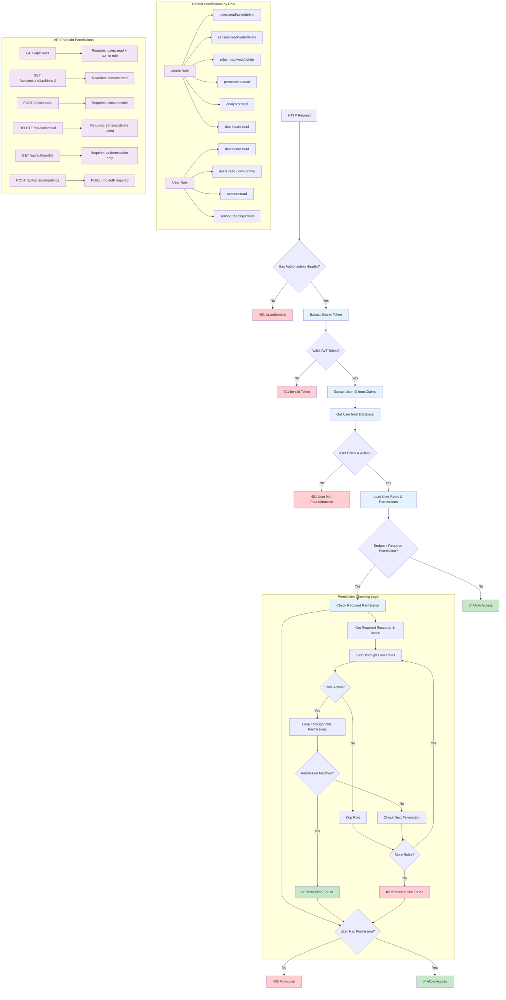

```mermaid
flowchart TD
    A[HTTP Request] --> B{Has Authorization Header?}
    
    B -->|No| C[401 Unauthorized]
    B -->|Yes| D[Extract Bearer Token]
    
    D --> E{Valid JWT Token?}
    E -->|No| F[401 Invalid Token]
    E -->|Yes| G[Extract User ID from Claims]
    
    G --> H[Get User from Database]
    H --> I{User Exists & Active?}
    I -->|No| J[401 User Not Found/Inactive]
    I -->|Yes| K[Load User Roles & Permissions]
    
    K --> L{Endpoint Requires Permission?}
    L -->|No| M[✅ Allow Access]
    L -->|Yes| N[Check Required Permission]
    
    N --> O{User Has Permission?}
    O -->|No| P[403 Forbidden]
    O -->|Yes| Q[✅ Allow Access]
    
    subgraph "Permission Checking Logic"
        N --> N1[Get Required Resource & Action]
        N1 --> N2[Loop Through User Roles]
        N2 --> N3{Role Active?}
        N3 -->|No| N4[Skip Role]
        N3 -->|Yes| N5[Loop Through Role Permissions]
        N5 --> N6{Permission Matches?}
        N6 -->|No| N7[Check Next Permission]
        N6 -->|Yes| N8[✅ Permission Found]
        N4 --> N9{More Roles?}
        N7 --> N9
        N9 -->|Yes| N2
        N9 -->|No| N10[❌ Permission Not Found]
        N8 --> O
        N10 --> O
    end
    
    subgraph "Default Permissions by Role"
        R1[Admin Role]
        R1 --> R1P1[users:read/write/delete]
        R1 --> R1P2[sensors:read/write/delete]
        R1 --> R1P3[roles:read/write/delete]
        R1 --> R1P4[permissions:read]
        R1 --> R1P5[analytics:read]
        R1 --> R1P6[dashboard:read]
        
        R2[User Role]
        R2 --> R2P1[dashboard:read]
        R2 --> R2P2[users:read - own profile]
        R2 --> R2P3[sensors:read]
        R2 --> R2P4[sensor_readings:read]
    end
    
    subgraph "API Endpoint Permissions"
        API1[GET /api/users] --> PERM1[Requires: users:read + admin role]
        API2[GET /api/sensors/dashboard] --> PERM2[Requires: sensors:read]
        API3[POST /api/sensors] --> PERM3[Requires: sensors:write]
        API4[DELETE /api/sensors/id] --> PERM4[Requires: sensors:delete using ]
        API5[GET /api/auth/profile] --> PERM5[Requires: authentication only]
        API6[POST /api/sensors/readings] --> PERM6[Public - no auth required]
    end

    %% Styling
    classDef successClass fill:#c8e6c9
    classDef errorClass fill:#ffcdd2
    classDef processClass fill:#e3f2fd
    classDef permissionClass fill:#f3e5f5

    class M,Q,N8 successClass
    class C,F,J,P,N10 errorClass
    class D,G,H,K,N processClass
    class R1,R2,API1,API2,API3,API4,API5,API6,PERM1,PERM2,PERM3,PERM4,PERM5,PERM6 permissionClass
```