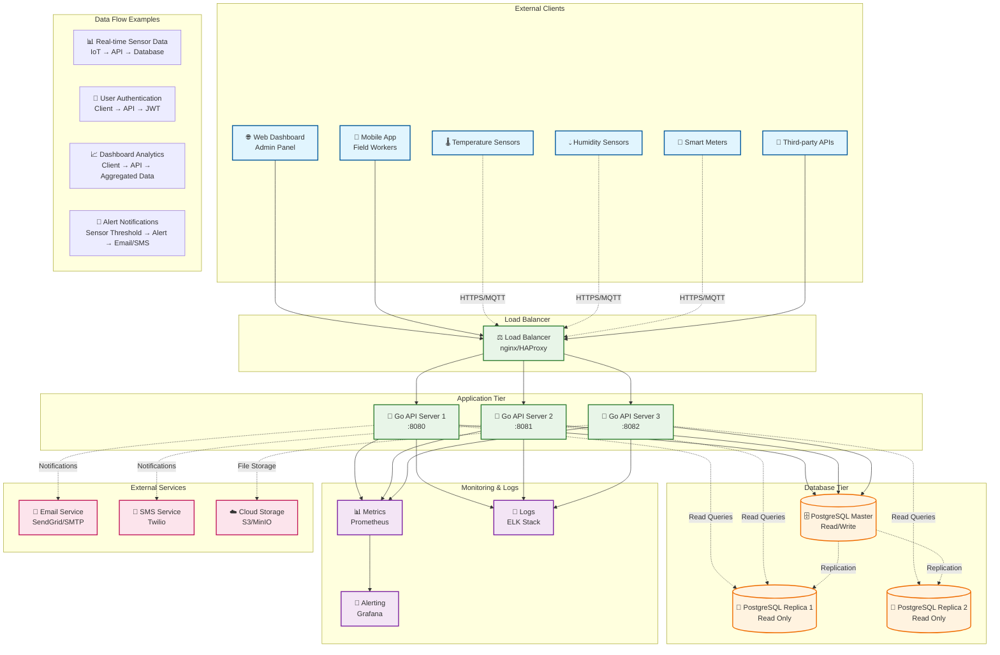

```mermaid
graph TB
    subgraph "External Clients"
        WEB[🌐 Web Dashboard<br/>Admin Panel]
        MOBILE[📱 Mobile App<br/>Field Workers]
        IOT1[🌡️ Temperature Sensors]
        IOT2[💧 Humidity Sensors]
        IOT3[🔌 Smart Meters]
        API[🔗 Third-party APIs]
    end

    subgraph "Load Balancer"
        LB[⚖️ Load Balancer<br/>nginx/HAProxy]
    end

    subgraph "Application Tier"
        APP1[🐹 Go API Server 1<br/>:8080]
        APP2[🐹 Go API Server 2<br/>:8081]
        APP3[🐹 Go API Server 3<br/>:8082]
    end

    subgraph "Database Tier"
        MASTER[(🗄️ PostgreSQL Master<br/>Read/Write)]
        SLAVE1[(📖 PostgreSQL Replica 1<br/>Read Only)]
        SLAVE2[(📖 PostgreSQL Replica 2<br/>Read Only)]
    end

    subgraph "Monitoring & Logs"
        METRICS[📊 Metrics<br/>Prometheus]
        LOGS[📝 Logs<br/>ELK Stack]
        ALERTS[🚨 Alerting<br/>Grafana]
    end

    subgraph "External Services"
        EMAIL[📧 Email Service<br/>SendGrid/SMTP]
        SMS[📱 SMS Service<br/>Twilio]
        CLOUD[☁️ Cloud Storage<br/>S3/MinIO]
    end

    %% Client connections
    WEB --> LB
    MOBILE --> LB
    IOT1 -.->|HTTPS/MQTT| LB
    IOT2 -.->|HTTPS/MQTT| LB
    IOT3 -.->|HTTPS/MQTT| LB
    API --> LB

    %% Load balancer to app servers
    LB --> APP1
    LB --> APP2
    LB --> APP3

    %% Database connections
    APP1 --> MASTER
    APP2 --> MASTER
    APP3 --> MASTER
    
    APP1 -.->|Read Queries| SLAVE1
    APP2 -.->|Read Queries| SLAVE1
    APP3 -.->|Read Queries| SLAVE2

    %% Database replication
    MASTER -.->|Replication| SLAVE1
    MASTER -.->|Replication| SLAVE2

    %% Monitoring connections
    APP1 --> METRICS
    APP2 --> METRICS
    APP3 --> METRICS
    
    APP1 --> LOGS
    APP2 --> LOGS
    APP3 --> LOGS
    
    METRICS --> ALERTS

    %% External service connections
    APP1 -.->|Notifications| EMAIL
    APP2 -.->|Notifications| SMS
    APP3 -.->|File Storage| CLOUD

    subgraph "Data Flow Examples"
        DF1[📊 Real-time Sensor Data<br/>IoT → API → Database]
        DF2[👤 User Authentication<br/>Client → API → JWT]
        DF3[📈 Dashboard Analytics<br/>Client → API → Aggregated Data]
        DF4[🔔 Alert Notifications<br/>Sensor Threshold → Alert → Email/SMS]
    end

    %% Styling
    classDef clientClass fill:#e1f5fe,stroke:#01579b,stroke-width:2px
    classDef serverClass fill:#e8f5e8,stroke:#2e7d32,stroke-width:2px
    classDef dbClass fill:#fff3e0,stroke:#ef6c00,stroke-width:2px
    classDef monitorClass fill:#f3e5f5,stroke:#7b1fa2,stroke-width:2px
    classDef externalClass fill:#fce4ec,stroke:#c2185b,stroke-width:2px

    class WEB,MOBILE,IOT1,IOT2,IOT3,API clientClass
    class LB,APP1,APP2,APP3 serverClass
    class MASTER,SLAVE1,SLAVE2 dbClass
    class METRICS,LOGS,ALERTS monitorClass
    class EMAIL,SMS,CLOUD externalClass
```