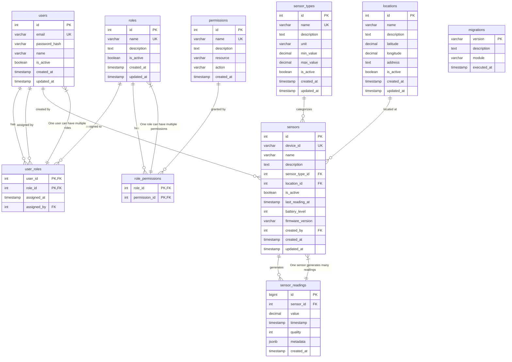

```mermaid
erDiagram
    %% User Management Schema
    users {
        int id PK
        varchar email UK
        varchar password_hash
        varchar name
        boolean is_active
        timestamp created_at
        timestamp updated_at
    }

    roles {
        int id PK
        varchar name UK
        text description
        boolean is_active
        timestamp created_at
        timestamp updated_at
    }

    permissions {
        int id PK
        varchar name UK
        text description
        varchar resource
        varchar action
        timestamp created_at
    }

    user_roles {
        int user_id PK,FK
        int role_id PK,FK
        timestamp assigned_at
        int assigned_by FK
    }

    role_permissions {
        int role_id PK,FK
        int permission_id PK,FK
    }

    %% Sensor Data Schema
    sensor_types {
        int id PK
        varchar name UK
        text description
        varchar unit
        decimal min_value
        decimal max_value
        boolean is_active
        timestamp created_at
        timestamp updated_at
    }

    locations {
        int id PK
        varchar name
        text description
        decimal latitude
        decimal longitude
        text address
        boolean is_active
        timestamp created_at
        timestamp updated_at
    }

    sensors {
        int id PK
        varchar device_id UK
        varchar name
        text description
        int sensor_type_id FK
        int location_id FK
        boolean is_active
        timestamp last_reading_at
        int battery_level
        varchar firmware_version
        int created_by FK
        timestamp created_at
        timestamp updated_at
    }

    sensor_readings {
        bigint id PK
        int sensor_id FK
        decimal value
        timestamp timestamp
        int quality
        jsonb metadata
        timestamp created_at
    }

    migrations {
        varchar version PK
        text description
        varchar module
        timestamp executed_at
    }

    %% Relationships
    users ||--o{ user_roles : "has"
    roles ||--o{ user_roles : "assigned to"
    roles ||--o{ role_permissions : "has"
    permissions ||--o{ role_permissions : "granted by"
    users ||--o{ user_roles : "assigned by"
    
    sensor_types ||--o{ sensors : "categorizes"
    locations ||--o{ sensors : "located at"
    users ||--o{ sensors : "created by"
    sensors ||--o{ sensor_readings : "generates"

    %% Notes
    users }|--|| user_roles : "One user can have multiple roles"
    roles }|--|| role_permissions : "One role can have multiple permissions"
    sensors }|--|| sensor_readings : "One sensor generates many readings"
```